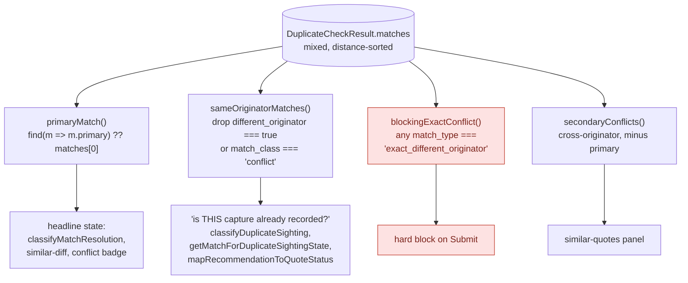
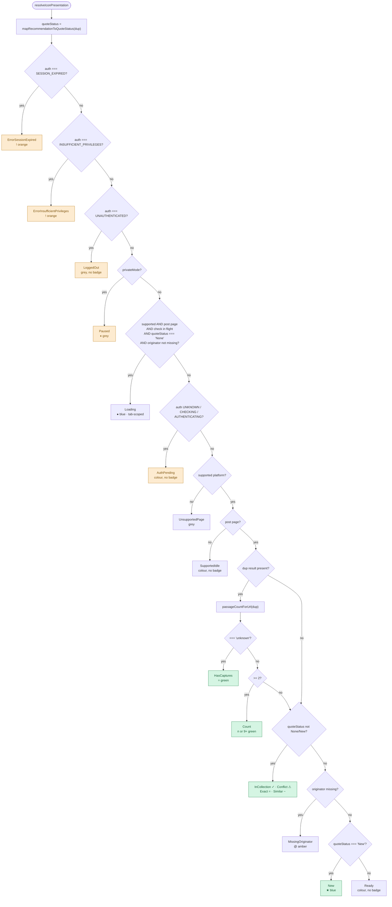
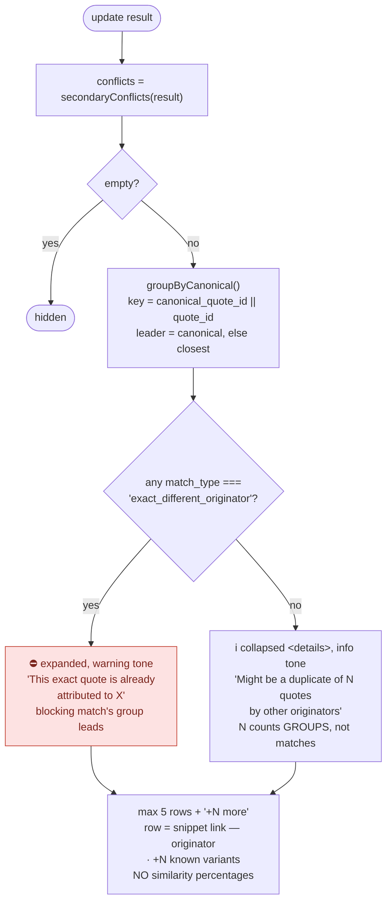
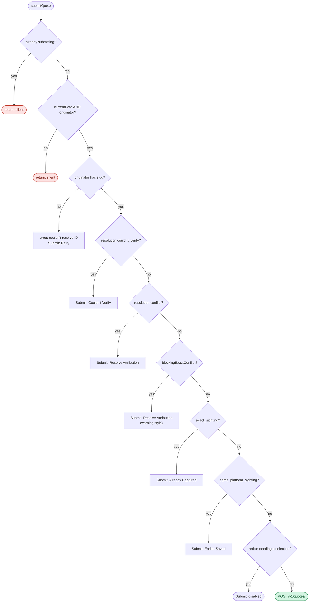

# Status & badging resolution

How a duplicate-check response becomes a toolbar icon, a tray badge, and a Submit
button state. Four independent decision chains, all fed by the same
`DuplicateCheckResult`.

**Source of truth** — this doc mirrors code, it does not govern it:

| chain | code |
|---|---|
| shared selectors | `src/utils/duplicate-status.ts` |
| toolbar icon | `src/background/icon-state-resolver.ts` + `src/config/icon-states.ts` |
| tray badge | `src/content/ui/components/duplicate-badge.ts` |
| Submit gate | `src/content/ui/overlay-bar.ts` (`submitQuote`) |

Related: [ADR-0001](./server-launch-adrs/ADR-0001-duplicate-check-match-provenance.md)
(match provenance), [ADR-0009](./server-launch-adrs/ADR-0009-duplicate-check-vector-sweep-and-primary-match.md)
(vector sweep, mixed match list, server-selected primary).

---

## 0. The match list — read this first

Since ADR-0009 the backend runs a pgvector sweep, so `matches` is **one
distance-sorted list mixing same-originator and cross-originator hits**. It used
to be homogeneous. Every selector below exists because of that change, and
getting the scope wrong is the single most common bug in this area.

**The rules, stated plainly:**

- **Never index `matches[0]`.** The server sorts the primary first for
  back-compat, but position is not the contract. Use `primaryMatch()`.
- **Never ask an unscoped `.some()` about this capture.** "Is it already
  collected / already sighted here?" must run over `sameOriginatorMatches()`.
  Another originator's quote answers a different question.
- **Never do similarity math.** Thresholds and precedence are server-owned. The
  only strength signal the client reads is `match_type ===
  'exact_different_originator'`, which the backend claims solely on proven byte
  equality — a fact, not a threshold.
- `match_class: 'conflict'` means *matched a different originator*, per ADR-0001.
  It is not a strength signal, and it is deliberately **not** orthogonalized.
- **Relation fields decorate, they never decide.** `quote_role`, `has_relations`
  and `canonical_quote_id` exist so a variant group isn't rendered as several
  independent duplicates. Only the positive direction is trustworthy:

  | field | trust |
  |---|---|
  | `canonical_quote_id` present | reliable (real FK) — absence proves nothing |
  | `has_relations: true` | reliable |
  | `has_relations: false` | **not** proof of "no relations" (948 rows lie) |
  | `quote_role: 'variant'` | **not** proof of an edge (1,780 rows lie) |

  Never conclude "unlinked, therefore safe to link" from these. Gate any write on
  the server's response to the link action itself. Authoritative pairwise edges
  are tracked in `qw-gqae3`.

---

## 1. Toolbar icon — `resolveIconPresentation()`

Strictly ordered; first match wins. Auth and private mode outrank everything,
including an in-flight check.

**Passage count outranks quote status.** A post with 2+ captured passages shows
the count, not `★`/`~`/`=` — "what's on this post" beats "what is this quote".

> **Sharp edge (verified, not fixed).** `passageCountForUrl()` returns `'unknown'`
> when `search_metadata.error` is true, and `'unknown'` maps to `HasCaptures`. So
> a *failed* duplicate check on a post page resolves to a green `=` "this post has
> captured passages" — asserting captures exist on the strength of a check that
> didn't complete. The tray gets this right (`couldnt_verify` → ⚠ + Retry); the
> icon does not. Reproduce with
> `resolveIconPresentation(AUTHENTICATED, {search_metadata:{error:true}}, {isPostPage:true, isSupportedPlatform:true, isCheckInFlight:false})`.

### Quote status mapping

`mapRecommendationToQuoteStatus()` — collection membership is checked *before*
the recommendation tiers, and only over same-originator matches.

| condition | status | badge |
|---|---|---|
| no result, or `search_metadata.error` | `None` | — |
| any **same-originator** match in a user collection | `InCollection` | ✓ green |
| `attribution_conflict` / `_resolved` | `Conflict` | ⚠ orange |
| `duplicate` / `duplicate_known_author` | `Exact` | `=` green |
| `new_version` / `new_version_known_author` | `Similar` | `~` amber |
| `new_quote` / `new_quote_known_author`, or unknown | `New` | ★ blue |

---

## 2. Tray badge — `DuplicateBadge.update()`

Driven by `classifyMatchResolution()`, which reads the **primary** match only.

### `classifyMatchResolution()` precedence

### `renderLegacyStatus()` fallback

Reached when resolution is `none` and the URL has no recorded passages. Uses
`classifyDuplicateSighting()` — **same-originator matches only**.

| sighting state / recommendation | badge | Submit |
|---|---|---|
| `exact_sighting` | ✓ Already captured this passage | View Quote |
| `same_platform_sighting` | 🟢 Earlier Sighting saved | View Sighting |
| `other_platform_sighting` | 🔵 Add sighting | Add Sighting |
| `recommendation: duplicate` | ⚠ Duplicate | View Quote |
| `recommendation: new_version` | ℹ️ New version | View Quote |
| `in_quotewise` | ✓ In Quotewise | View Quote |
| `recommendation: new_quote` | *(none)* | enabled |

---

## 3. Similar-quotes panel — `SimilarPanel.update()`

Sits between the quote row and the collection rows. Certainty is carried by the
disclosure state, not by hedged wording.

Grouping is display-only. `has_relations` and `quote_role` are never consulted —
only `canonical_quote_id`, and only in the positive direction.

Post-submit (`showPostSubmit`, ADR-0009 §5) reuses the panel in advisory tone —
the quote was created regardless — and **suppresses the 1000ms auto-hide** so the
heads-up can actually be read.

---

## 4. Submit gate — `submitQuote()`

Ordered; first match wins and returns without submitting. This is enforcement,
not decoration — the badge sets button state, this re-checks at click time.

> **Trap.** Gates 1 and 2 return with **no user-visible feedback**, and gates 4–8
> report by relabelling the Submit button. When the user acted somewhere else —
> "Add as variant" inside the similar panel — that feedback lands where they
> aren't looking and the click reads as broken. Any new veto must either surface
> itself where the action was taken, or withhold the affordance up front (which
> is what gate 6 does: the decision buttons are not rendered at all).

---

## Quick reference — badge glyphs

| glyph | state | colour |
|---|---|---|
| *(none)* | Ready / SupportedIdle / AuthPending | — |
| `●` | Loading (check in flight) | `#56B4E9` |
| `★` | New | `#0072B2` |
| `~` | Similar | `#E69F00` |
| `=` | Exact / HasCaptures | `#009E73` |
| `2`…`9+` | Count (passages on this post) | `#009E73` |
| `✓` | InCollection | `#009E73` |
| `⚠` | Conflict | `#D55E00` |
| `@` | MissingOriginator | `#E69F00` |
| `!` | Session expired / insufficient privileges | `#D55E00` |
| `⏸︎` | Paused (private mode) | `#64748B` |

Icon scope: `global` states apply to every tab; `tab` states are per-tab
(`Loading`, `Count`, and every quote-status state).
