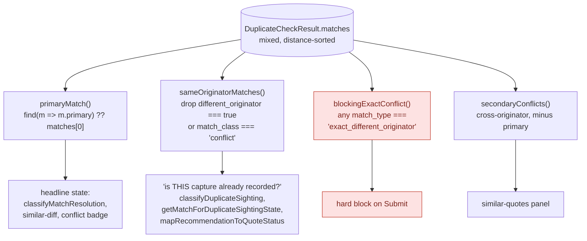
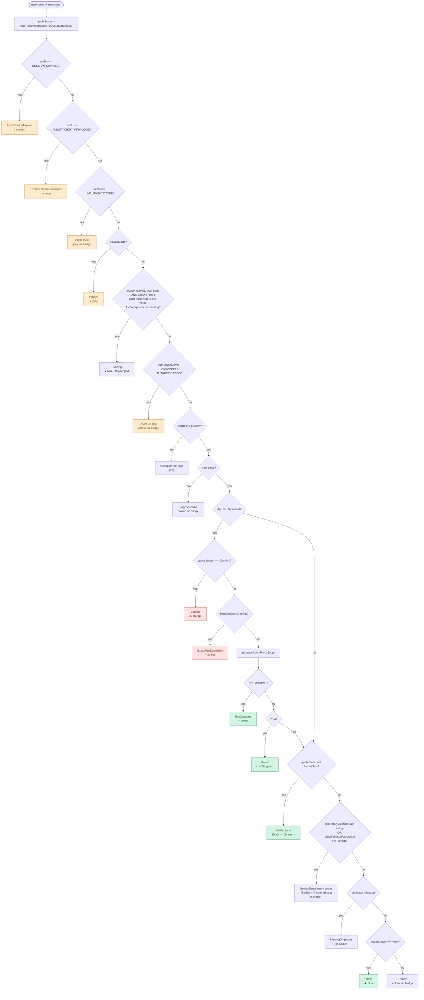
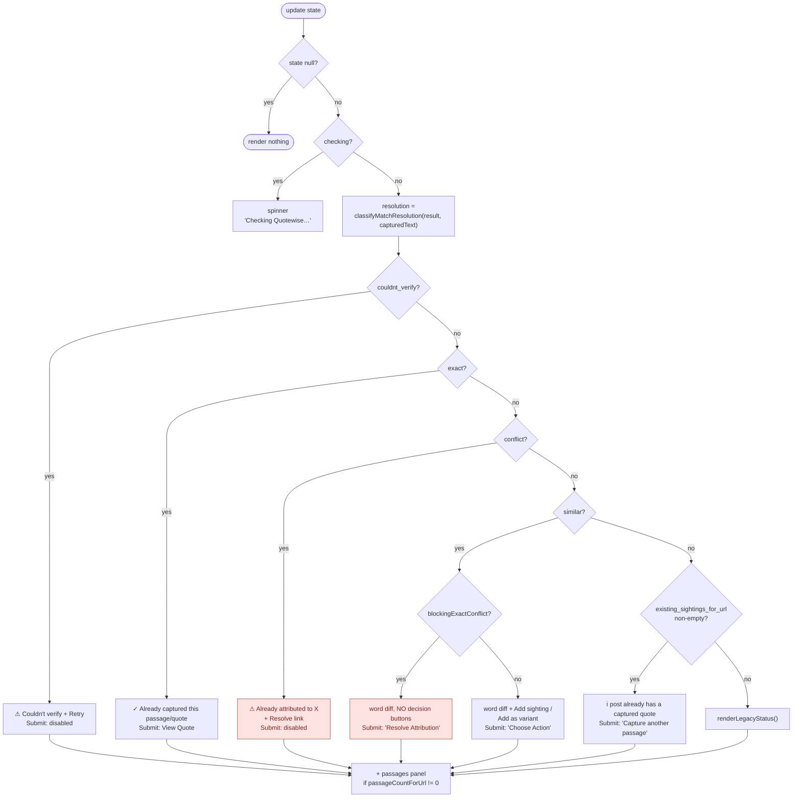
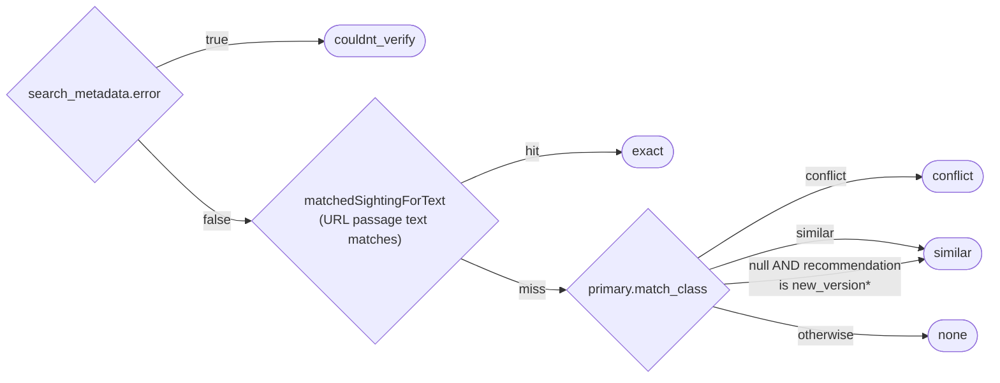
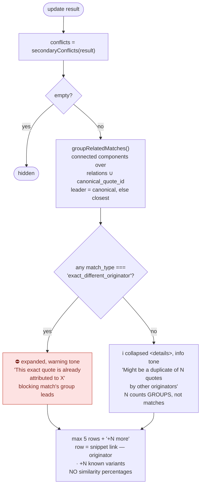

# Status & badging resolution

How a duplicate-check response becomes a toolbar icon, a tray badge, and a Submit
button state. Four independent decision chains, all fed by the same
`DuplicateCheckResult`.

**Source of truth** — this doc mirrors code, it does not govern it:

| chain | code |
|---|---|
| shared selectors | `src/utils/duplicate-status.ts` |
| toolbar icon | `src/background/icon-state-resolver.ts` + `src/config/icon-states.ts` |
| tray badge | `src/content/ui/components/duplicate-badge.ts` |
| Submit gate | `src/content/ui/overlay-bar.ts` (`submitQuote`) |

Related: [ADR-0001](./server-launch-adrs/ADR-0001-duplicate-check-match-provenance.md)
(match provenance), [ADR-0009](./server-launch-adrs/ADR-0009-duplicate-check-vector-sweep-and-primary-match.md)
(vector sweep, mixed match list, server-selected primary).

---

## 0. The match list — read this first

Since ADR-0009 the backend runs a pgvector sweep, so `matches` is **one
distance-sorted list mixing same-originator and cross-originator hits**. It used
to be homogeneous. Every selector below exists because of that change, and
getting the scope wrong is the single most common bug in this area.

**The rules, stated plainly:**

- **Never index `matches[0]`.** The server sorts the primary first for
  back-compat, but position is not the contract. Use `primaryMatch()`.
- **Never ask an unscoped `.some()` about this capture.** "Is it already
  collected / already sighted here?" must run over `sameOriginatorMatches()`.
  Another originator's quote answers a different question.
- **Never do similarity math.** Thresholds and precedence are server-owned. The
  only strength signal the client reads is `match_type ===
  'exact_different_originator'`, which the backend claims solely on proven byte
  equality — a fact, not a threshold.
- `match_class: 'conflict'` means *matched a different originator*, per ADR-0001.
  It is not a strength signal, and it is deliberately **not** orthogonalized.
- **`relations` decides; the other relation fields only decorate.**

  | field | trust | use for |
  |---|---|---|
  | `relations` | **authoritative** — read from the graph, no drift. Scope is edges *between returned matches*; `[]` means "not linked to anything else here", never "unlinked" | grouping, gating a link action |
  | `canonical_quote_id` present | reliable (real FK) — absence proves nothing | grouping (additive only) |
  | `has_relations: true` | reliable | decoration |
  | `has_relations: false` | **not** proof of "no relations" (948 rows lie) | nothing |
  | `quote_role: 'variant'` | **not** proof of an edge (1,780 rows lie) | nothing |

  Never conclude "unlinked, therefore safe to link" from the bottom three.

---

## 1. Toolbar icon — `resolveIconPresentation()`

Strictly ordered; first match wins. Auth and private mode outrank everything,
including an in-flight check.

**Attribution outranks everything on the page**, passage counts and collection
membership included. Whether the capture can proceed at all beats context about
what else lives on this post.

Glyph says what kind of match; colour says whose it is:

| | same originator | cross-originator |
|---|---|---|
| exact text | `=` **green** — `Exact` | `=` **amber** — `ExactAlsoElsewhere`, blocks Submit |
| similar text | `~` amber — `Similar` | `~` amber — `SimilarElsewhere`, advisory |

Two deliberate choices there:

- **`Conflict` (⚠) is kept for the case where the other originator's quote *is*
  the match.** `ExactAlsoElsewhere` is the narrower situation — you legitimately
  have the quote *and* so does someone else — so it keeps the same-text glyph and
  changes only the colour. Splitting them means the strongest signal is not
  weakened and each glyph keeps one meaning.
- **`Similar` and `SimilarElsewhere` are visually identical** (`~` amber) and
  differ only in title. Neither blocks anything and both mean "open the tray"; a
  fifth colour would encode a distinction nobody acts on.

**Passage count outranks the remaining quote statuses.** A post with 2+ captured
passages shows the count, not `★`/`~`/`=` — once attribution is settled, "what's
on this post" beats "what is this quote".

> **The badge is URL-scoped until the tray opens — by design, do not "fix" it.**
> The automatic preflight sends `{ handle, platform, source_url }` and deliberately
> **no post text** (`service-worker.ts:2705`; `api-handler.ts:403` falls back to
> probing with the URL). Text travels only once the user opens the tray, which is
> the first sign of intent to interact with Quotewise — sending it on view would
> collect data from people who never asked for anything, and would not survive
> capture expanding beyond post pages.
>
> Consequence: at rest the badge can say "this post already has captures" and
> "this handle is not an originator", but never "this text is already in
> Quotewise". A badge that changes when the tray opens is expected here, not a
> bug. See ADR-0009's 2026-07-19 amendment.

> **`recommendation` and `match_class` can disagree — trust the matches.**
> With no originator the server cannot recommend a *version* (there is nobody to
> version it under), so it answers `new_quote` while the matches still carry
> `match_class: 'similar'`. `mapRecommendationToQuoteStatus` reads only
> `recommendation`; `classifyMatchResolution` reads `match_class`. An icon that
> consults just the first contradicts the tray on the very same response — an
> Asimov quote posted by an unknown handle badged `@` while the tray offered
> "Add as variant". The resolver falls back to `classifyMatchResolution` before
> `MissingOriginator` for exactly this reason.

**`passageCountForUrl()` is three-valued, and the distinction is load-bearing:**

| return | means | caller may claim |
|---|---|---|
| `number` | counted | exact count |
| `'unknown'` | captures exist, count unavailable (≥50, malformed total) | "this post has captures" |
| `null` | **no information** — absent result, or `search_metadata.error` | nothing, in either direction |

The last two shared the `'unknown'` sentinel until v1.7.0, so a check that never
completed rendered as positive evidence: a green `=` on the toolbar, and a "This
post already has captures" line sitting under the tray's own "Couldn't verify
duplicates" warning. `null` is deliberately not `0` — `0` is a claim ("no
captures") that a failed check hasn't earned either, and the nullable type makes
the compiler demand every caller handle it.

### Quote status mapping

`mapRecommendationToQuoteStatus()` — collection membership is checked *before*
the recommendation tiers, and only over same-originator matches.

| condition | status | badge |
|---|---|---|
| no result, or `search_metadata.error` | `None` | — |
| any **same-originator** match in a user collection | `InCollection` | ✓ green |
| `attribution_conflict` / `_resolved` | `Conflict` | ⚠ orange |
| `duplicate` / `duplicate_known_author` | `Exact` | `=` green |
| `new_version` / `new_version_known_author` | `Similar` | `~` amber |
| `new_quote` / `new_quote_known_author`, or unknown | `New` | ★ blue |

---

## 2. Tray badge — `DuplicateBadge.update()`

Driven by `classifyMatchResolution()`, which reads the **primary** match only.

### `classifyMatchResolution()` precedence

### `renderLegacyStatus()` fallback

Reached when resolution is `none` and the URL has no recorded passages. Uses
`classifyDuplicateSighting()` — **same-originator matches only**.

| sighting state / recommendation | badge | Submit |
|---|---|---|
| `exact_sighting` | ✓ Already captured this passage/quote | View Quote |
| `same_platform_sighting` | 🟢 Earlier Sighting saved | View Sighting |
| `other_platform_sighting` | 🔵 Add sighting | Add Sighting |
| `recommendation: duplicate` | ⚠ Duplicate | View Quote |
| `recommendation: new_version` | ℹ️ New version | View Quote |
| `in_quotewise` | ✓ In Quotewise | View Quote |
| `recommendation: new_quote` | *(none)* | enabled |

---

## 3. Similar-quotes panel — `SimilarPanel.update()`

Sits between the quote row and the collection rows. Certainty is carried by the
disclosure state, not by hedged wording.

Grouping uses `relations` (authoritative) unioned with `canonical_quote_id`
(additive hint). `has_relations` and `quote_role` are never consulted. Components
are transitive: A–B and B–C land in one group with no direct A–C edge.

## 3a. No originator resolved

A check may run with `originator_slug` omitted — supported since ADR-0009, ~10ms
warm. With nothing claimed there is nothing to conflict *with*, so the server
classifies on strength alone:

| field | value |
|---|---|
| `different_originator` | always `false` |
| `match_class` | `exact` or `similar` — **never** `conflict` |
| `match.originator` | the matched quote's *real* attribution — read it from here |
| `search_metadata.lexical_search_skipped_unscoped` | `true` |

Consequences, all of which fall out of the selectors rather than needing special
cases: `sameOriginatorMatches()` keeps everything, `blockingExactConflict()`
never fires, and the similar panel stays hidden — correctly, since "other
originators" is not a meaningful category without a target originator.

Two things this path must respect:

- **Submit can never be enabled.** The badge reasons about the quote, not the
  attribution, so it will ask for an enabled Submit. `submitQuote` would return
  in silence at its `!originator` guard, so the directive is vetoed in
  `onSubmitStateChange` and the button reads "Add originator first".
  `view_quote` directives pass through — the quote exists, reading it is useful.
- **No link decisions either.** "Add another sighting" / "Add as variant" route
  straight to `submitQuote` and hit the same silent guard, so the badge is told
  via `update(..., { hasOriginator })` to withhold them. The word diff still
  renders — comparing the two texts is the useful part regardless.
- **Collections still work.** Adding an *existing* quote to a collection routes
  through `addExistingQuoteToSelectedCollections()`, which needs no originator.
  That path is deliberately not vetoed.

An empty result here is advisory, never proof the quote is new — the lexical pass
that catches punctuation-only variants does not run. Re-check once an originator
is chosen.

Post-submit (`showPostSubmit`, ADR-0009 §5) reuses the panel in advisory tone —
the quote was created regardless — and **suppresses the 1000ms auto-hide** so the
heads-up can actually be read.

---

## 4. Submit gate — `submitQuote()`

Ordered; first match wins and returns without submitting. This is enforcement,
not decoration — the badge sets button state, this re-checks at click time.

> **Trap.** Gates 1 and 2 return with **no user-visible feedback**, and gates 4–8
> report by relabelling the Submit button. When the user acted somewhere else —
> "Add as variant" inside the similar panel — that feedback lands where they
> aren't looking and the click reads as broken. Any new veto must either surface
> itself where the action was taken, or withhold the affordance up front (which
> is what gate 6 does: the decision buttons are not rendered at all).

---

## Quick reference — badge glyphs

| glyph | state | colour |
|---|---|---|
| *(none)* | Ready / SupportedIdle / AuthPending | — |
| `●` | Loading (check in flight) | `#56B4E9` |
| `★` | New | `#0072B2` |
| `~` | Similar / SimilarElsewhere | `#E69F00` |
| `=` | Exact / HasCaptures | `#009E73` |
| `=` | ExactAlsoElsewhere | `#E69F00` |
| `2`…`9+` | Count (passages on this post) | `#009E73` |
| `✓` | InCollection | `#009E73` |
| `⚠` | Conflict | `#D55E00` |
| `@` | MissingOriginator | `#E69F00` |
| `!` | Session expired / insufficient privileges | `#D55E00` |
| `⏸︎` | Paused (private mode) | `#64748B` |

Icon scope: `global` states apply to every tab; `tab` states are per-tab
(`Loading`, `Count`, and every quote-status state).
