# Contract: Automatic Preflight Lifecycle

**Feature**: `004-extension-icon-states`

This contract documents the current-tweet automatic extraction, preflight, originator-probe, timeout,
and stale-response lifecycle implemented by `src/background/service-worker.ts`. The purpose is to make
the timing model understandable without reading the service worker end to end.

The resolver state diagram lives in [icon-state-resolver.md](./icon-state-resolver.md). This document
covers the event lifecycle that feeds resolver context.

## Lifecycle State Diagram

```mermaid
stateDiagram-v2
  direction TB

  [*] --> TweetNavigationDetected

  state "Tweet navigation detected" as TweetNavigationDetected
  state "Extraction requested" as ExtractionRequested
  state "Extraction retry wait" as ExtractionRetryWait
  state "Valid current tweet data accepted" as ValidTweetDataAccepted
  state "Automatic preflight in flight" as AutomaticPreflightInFlight
  state "300 ms originator-probe delay" as ProbeDelay
  state "Originator probe sent" as ProbeSent
  state "Originator status applied" as OriginatorStatusApplied
  state "Combined preflight applied" as CombinedPreflightApplied
  state "8 s combined-preflight timeout" as CombinedPreflightTimeout
  state "Originator fallback sent" as FallbackSent
  state "Fallback resolved or cleared" as FallbackResolved
  state "Stale response ignored" as StaleIgnored
  state "Keepalive released" as KeepaliveReleased

  TweetNavigationDetected --> ExtractionRequested: tab update or history state
  ExtractionRequested --> ExtractionRequested: same tab/status extraction deduped
  ExtractionRequested --> ExtractionRetryWait: no data or stale parent data
  ExtractionRetryWait --> ExtractionRequested: bounded retry for requested status ID
  ExtractionRequested --> ValidTweetDataAccepted: status ID matches current URL
  ExtractionRequested --> StaleIgnored: status ID changed before acceptance

  ValidTweetDataAccepted --> AutomaticPreflightInFlight: start one operation per tab/status
  ValidTweetDataAccepted --> AutomaticPreflightInFlight: same tab/status preflight deduped
  AutomaticPreflightInFlight --> ProbeDelay: schedule early handle lookup
  AutomaticPreflightInFlight --> CombinedPreflightApplied: combined preflight response wins
  AutomaticPreflightInFlight --> CombinedPreflightTimeout: no combined result after 8 s
  AutomaticPreflightInFlight --> StaleIgnored: navigation replaces operation

  ProbeDelay --> ProbeSent: operation still current after 300 ms
  ProbeDelay --> CombinedPreflightApplied: preflight won before probe
  ProbeDelay --> StaleIgnored: stale before probe request
  ProbeSent --> OriginatorStatusApplied: found or not found within lookup bound
  ProbeSent --> StaleIgnored: response for prior tweet/status
  ProbeSent --> AutomaticPreflightInFlight: lookup timeout; keep waiting for combined result

  CombinedPreflightTimeout --> FallbackSent: current tweet still has handle
  CombinedPreflightTimeout --> FallbackResolved: no handle or fallback unavailable
  FallbackSent --> FallbackResolved: not found, found, timeout, or error
  FallbackSent --> StaleIgnored: navigation/superseding operation

  OriginatorStatusApplied --> KeepaliveReleased: first terminal toolbar status applied
  CombinedPreflightApplied --> KeepaliveReleased: duplicate/originator context applied
  FallbackResolved --> KeepaliveReleased: loading replaced or cleared
  StaleIgnored --> KeepaliveReleased: no mutation for current tweet
```



## Timing And Dedupe Rules

- Tweet identity is the status ID in the active tab URL. Extracted tweet data, duplicate results,
  originator results, and tray-originator messages are valid only for the same current status ID.
- Navigation can fire both `history_state_updated` and `tabs.onUpdated`; the worker dedupes extraction
  and automatic preflight by `{tabId}:{statusId}`.
- Stale parent/head tweet extraction for a reply URL schedules bounded retries and never starts
  automatic preflight for the wrong status ID.
- Automatic combined preflight gets an 8-second timeout. Late combined-preflight results are accepted
  only when the tab still shows the same status ID.
- The early originator probe is delayed by 300 ms. This gives very fast combined-preflight responses a
  chance to win while still surfacing missing-originator results quickly when combined preflight is slow.
- Probe and fallback responses are ignored after navigation or after another operation supersedes the
  current one.
- Known quote or missing-originator status suppresses Loading during background revalidation so the
  toolbar does not flicker from a terminal badge back to the loading dot.

## Diagnostic Event Trail

The in-memory event trail records the last 20 lifecycle events only in debug/non-production builds:

```ts
DEBUG_MODE && !isProduction()
```

Production diagnostics still expose the compact `extraction` and `preflight` snapshots, but
`events` remains empty. The event trail is token-safe: it records timing, tab/status/source URL,
handle, operation ID, trigger, reason, and classification fields, but never quote text, auth tokens,
or response bodies.

Important classifications:

| Classification | Meaning |
|---|---|
| `extraction_retry_before_preflight` | No valid current tweet data existed yet, so no automatic preflight/probe could start. |
| `probe_lookup_timeout` | The early probe was sent, but handle lookup did not answer within its bounded lookup window. |
| `probe_stale_after_navigation` | The probe was skipped or ignored because the tab navigated or the operation was replaced. |
| `combined_preflight_timeout` | The normal 8-second automatic preflight timeout path was reached. |
| `preflight_won_before_probe` | Combined preflight completed before the delayed originator probe was sent. |
