# Contract: Icon State Resolver & Applicator

**Feature**: `004-extension-icon-states`

The extension exposes no public/network API here. The "interface contract" is the **internal seam**
between the pure decision logic and the side-effecting Chrome calls — the seam everything else in the
worker depends on, and the one that makes the surface deterministic and testable (FR-070, SC-005).

---

## C1. `resolveIconPresentation` — pure decision function

**Module**: `src/background/icon-state-resolver.ts`

```ts
import type { AuthState } from '../auth/auth-state-machine';
import type { DuplicateCheckResult } from '../types/api';

export interface TabContext {
  tabId: number;
  isSupportedPlatform: boolean;
  isTweetPage: boolean;
  isCheckInFlight: boolean;
  isOriginatorMissing?: boolean;
  currentTweetStatusId?: string;
  currentTweetUrl?: string;
}

export interface IconPresentation {
  iconVariant: 'color' | 'grey';
  badgeText: string;        // '' clears the badge
  badgeColor: string;       // hex; ignored when badgeText === ''
  title: string;            // self-contained accessible label
  scope: 'global' | 'tab';
}

/** Total, pure, deterministic. No chrome.* calls, no I/O, no throw. */
export function resolveIconPresentation(
  auth: AuthState,
  dup: DuplicateCheckResult | null,
  tab: TabContext,
  privateMode?: boolean,
): IconPresentation;
```

**Guarantees** (verified by `tests/background/icon-state-resolver.test.ts`):
- **Total**: defined for every `(AuthState × DuplicateCheckResult|null × TabContext)`; unknown
  `recommendation` ⇒ New, malformed/errored result ⇒ no quote badge (V.2, FR-041).
- **Deterministic & pure**: same inputs ⇒ identical output; no reads of `chrome.*`, clock, or module
  state. Re-entrant under SW termination (V.1).
- **Single-valued**: returns exactly one `IconPresentation` per call (FR-030).
- **Precedence**: follows data-model §6 exactly. Anchored by the §6.1 tie table.
- **Missing originator**: `tab.isOriginatorMissing` inserts `@ #E69F00` after
  Exact/Similar/Conflict and before New; it is resolver context from preflight, not duplicate recommendation data.
- **Current-tweet binding**: callers must only pass duplicate/originator context that matches
  `tab.currentTweetStatusId`/`tab.currentTweetUrl`; stale parent/head tweet context is invalid for a reply URL.
- **Platform availability**: `tab.isSupportedPlatform === false` returns UnsupportedPage (grey/no badge) for
  authenticated users and prevents Ready, Loading, or quote-status badges on unsupported sites.
- **Paused private mode**: `privateMode === true` returns Paused after auth errors/logged-out, before Loading,
  AuthPending, unsupported/idle, and quote-status badges. Paused is global because Private mode is global.
- **Auth-pending**: `UNKNOWN`/`CHECKING`/`AUTHENTICATING` never produce quote-status badges or
  "ready to capture" copy.
- **No badge text color**: the type has no field for it; the applicator must not call
  `setBadgeTextColor` (FR-003).

### C1.1 Resolver State Diagram

This diagram is the canonical resolver precedence model. It is intentionally a priority diagram, not
an event lifecycle: `resolveIconPresentation` receives the current auth, duplicate, originator, and
tab context and returns exactly one state.

```mermaid
stateDiagram-v2
  direction TB

  [*] --> ResolveCurrentTab

  state "Resolve current tab" as ResolveCurrentTab
  state "Error: session expired\nfull-color owl + !" as ErrorSessionExpired
  state "Error: insufficient privileges\nfull-color owl + !" as ErrorInsufficientPrivileges
  state "Logged out\ngrey owl, no badge" as LoggedOut
  state "Paused private mode\ngrey owl + pause" as Paused
  state "Loading\nfull-color owl + dot" as Loading
  state "Auth pending\nfull-color owl, no badge" as AuthPending
  state "Unsupported page\ngrey owl, no badge" as UnsupportedPage
  state "Supported idle\nfull-color owl, no badge" as SupportedIdle
  state "In collection\nfull-color owl + check" as InCollection
  state "Attribution conflict\nfull-color owl + warning" as Conflict
  state "Exact duplicate\nfull-color owl + equals" as Exact
  state "Similar version\nfull-color owl + tilde" as Similar
  state "Missing originator\nfull-color owl + at" as MissingOriginator
  state "New quote\nfull-color owl + star" as New
  state "Ready\nfull-color owl, no badge" as Ready

  ResolveCurrentTab --> ErrorSessionExpired: auth = SESSION_EXPIRED
  ResolveCurrentTab --> ErrorInsufficientPrivileges: auth = INSUFFICIENT_PRIVILEGES
  ResolveCurrentTab --> LoggedOut: auth = UNAUTHENTICATED
  ResolveCurrentTab --> Paused: privateMode = true
  ResolveCurrentTab --> Loading: supported tweet + check in flight\nand no known quote/originator status
  ResolveCurrentTab --> AuthPending: auth = UNKNOWN/CHECKING/AUTHENTICATING
  ResolveCurrentTab --> UnsupportedPage: authenticated + unsupported platform
  ResolveCurrentTab --> SupportedIdle: authenticated + supported non-tweet page
  ResolveCurrentTab --> InCollection: authenticated tweet + collected match
  ResolveCurrentTab --> Conflict: authenticated tweet + attribution conflict
  ResolveCurrentTab --> Exact: authenticated tweet + exact duplicate
  ResolveCurrentTab --> Similar: authenticated tweet + similar duplicate
  ResolveCurrentTab --> MissingOriginator: authenticated tweet + originator missing
  ResolveCurrentTab --> New: authenticated tweet + new quote
  ResolveCurrentTab --> Ready: authenticated tweet + no quote status

  note right of Loading
    Loading is suppressed once the current
    tweet already has a known quote status
    or missing-originator status. This avoids
    star/dot/star flicker during revalidation.
  end note
```



## C2. `mapRecommendationToQuoteStatus` — exported helper

**Module**: `src/utils/duplicate-status.ts` (extends the existing file; keeps
`classifyDuplicateSighting` for the tray).

```ts
export type QuoteStatus = 'None' | 'InCollection' | 'Conflict' | 'Exact' | 'Similar' | 'New';

/** FR-040 / Decision D5. Reads recommendation + in_user_collections only. */
export function mapRecommendationToQuoteStatus(
  result: DuplicateCheckResult | null,
): QuoteStatus;
```

**Guarantees**: implements the data-model §5 ladder; `in_user_collections` short-circuits to
`InCollection`; never reads `match_type`/`similarity` for selection; `null`/`search_metadata.error`
⇒ `None`. Missing-originator is intentionally not returned here.

## C3. `applyIconPresentation` — the only `chrome.action` caller

**Module**: `src/background/icon-applicator.ts` (or a private section of `service-worker.ts`).

```ts
export interface ApplyIconPresentationOptions {
  /** Auth-transition cleanup only: overwrite a tab-scoped prior state with a global presentation. */
  forceTabScope?: boolean;
}

export async function applyIconPresentation(
  p: IconPresentation,
  tabId: number,
  options?: ApplyIconPresentationOptions,
): Promise<void>;
```

**Application contract** (Context7 Chrome `action` ref):
0. Compute `effectiveScope = options?.forceTabScope ? 'tab' : p.scope`.
1. `setIcon` — `iconVariant === 'grey'` ⇒ `{ path: greyPaths }`; `'color'` ⇒ `{ path: colorPaths }`.
   - `paths = { 16, 32, 48, 128 }` under `icons/…` (bundle-relative).
   - `effectiveScope === 'tab'` ⇒ pass `{ tabId }`; `'global'` ⇒ no `tabId` (sets the default for all tabs).
2. `setBadgeText({ [tabId?], text: p.badgeText })` — `''` clears.
3. If `p.badgeText !== ''`: `setBadgeBackgroundColor({ [tabId?], color: p.badgeColor })`.
4. **Never** call `setBadgeTextColor` (FR-003 — Chrome 110+ auto-contrasts).
5. `setTitle({ [tabId?], title: p.title })` — always paired with every visual change (FR-050).
6. `tabId` is included **iff** `effectiveScope === 'tab'`.
7. `forceTabScope` is only for auth-transition cleanup: it lets a global auth presentation overwrite
   a prior tab-scoped quote/loading presentation without changing the resolver's output.

**Idempotence**: calling `applyIconPresentation` repeatedly with equal `p` yields the same toolbar
state — safe to re-run on every worker wake (V.1).

## C4. Clearing / auth-transition contract (FR-002, SC-003, SC-007)

Chrome tab-scoped action settings beat global settings. Therefore a prior tab-scoped quote/loading
presentation (`★`, `✓`, `=`, `~`, `@`, `⚠`, or `●`, plus its tab-scoped color icon) can survive a later
global auth presentation unless the tab itself is overwritten.

On any auth transition that resolves to `LoggedOut`, `AuthPending`, `Ready`, or `Error`, the worker
MUST:
1. Apply the resolved presentation globally (default for tabs without a tab-scoped override).
2. Enumerate affected tweet tabs (all open `twitter.com`/`x.com` status tabs plus any tab ids that
   received a tab-scoped presentation during this worker lifetime) and call:
   ```ts
   await applyIconPresentation(p, tabId, { forceTabScope: true });
   ```
   This clears the prior tab badge for no-badge states and re-applies the target icon/title with
   `{ tabId }`; for `Error`, it replaces any quote badge with `!`.

On navigation to a non-tweet page, tab close, or tab switch away from a tweet (`tabs.onActivated`),
the worker MUST:
```ts
chrome.action.setBadgeText({ tabId, text: '' });   // drop the stale per-tab quote badge
// then re-resolve ambient/auth state for this tab and apply with forceTabScope when the
// resolved presentation is global, so stale tab-scoped icon/title settings are overwritten too
```
No tab may retain another tab's quote-status badge.

On navigation to an unsupported site, the worker applies the same stale-state cleanup and resolves to
UnsupportedPage for authenticated users: grey owl, no badge, title "Quotewise — capture works on X/Twitter tweets".

Required test: start from a tab-scoped `New` (`★`) presentation, transition auth to
`UNAUTHENTICATED` and to `SESSION_EXPIRED`, and assert the affected tab receives a tab-scoped
overwrite with no `★` remaining (grey/no badge for logged-out; `!` for error).

API responses that carry `authRequired:true` are auth transitions for presentation purposes. The
service worker MUST normalize those responses into `SESSION_EXPIRED` or `INSUFFICIENT_PRIVILEGES`,
update `AuthStateManager`, and immediately apply the resolved Error presentation to the sender tab
with `{ tabId }` so any prior tab-scoped quote badge is overwritten before the tray finishes rendering
login/permissions-required UI.

## C5. Current-tweet preflight and tray-originator synchronization

**Modules**:
- `src/background/service-worker.ts`
- `src/content/ui/components/originator-lookup.ts`
- `src/platforms/twitter/adapter.ts`

**Current-tweet identity**
- Current capture support is X/Twitter only; supported-platform detection is a URL/platform-adapter concern that
  sets `tab.isSupportedPlatform`.
- A tweet page is identified by the status ID in the active tab URL.
- Extracted tweet data, duplicate results, missing-originator results, and tray-originator lookup
  results are valid for a tab only when their source URL/status ID matches the active tab's current tweet.
- A parent/head tweet result MUST NOT be applied after the user navigates into a reply with a different status ID.

**Automatic extraction retry**
- If navigation-triggered extraction returns no tweet data, or data for a different status ID, the
  worker schedules a short bounded retry for the same requested status ID.
- Retry timers are canceled on success, status-ID change, tab close, non-tweet navigation, or auth-invalid state.
- Stale extraction does not run duplicate/originator preflight and does not apply a quote-status badge.

**Automatic preflight loading operation**
- Automatic `Loading` is an operation record, not a bare tab boolean: `{tabId, source_url, status_id, operation_id,
  trigger, started_at, timeout_at, handle?}`.
- The worker persists automatic records in `chrome.storage.session`, schedules an 8-second timeout alarm, and
  reconciles pending/expired records on worker startup.
- While the same combined-preflight operation remains current, the worker may run one short delayed
  `LOOKUP_ORIGINATOR_BY_HANDLE` probe with `{handle, platform, source_url}`. Probe `found:false` caches
  `preloadedOriginator`, clears only automatic Loading for that tweet, and applies `@`; probe `found:true` caches the
  originator for the tray and leaves Loading in place until duplicate/preflight status resolves. Probe responses are
  ignored after navigation or if another operation has replaced/cleared the automatic preflight.
- Timeout for the same current tweet starts one short handle-only originator fallback when a handle is available.
  A fallback not-found result replaces `Loading` directly with `@`; fallback timeout/error clears `Loading` and
  re-resolves the same tweet. Late combined-preflight results are accepted only if the tab still shows that status
  ID; stale results for a different current tweet are ignored.
- Adapter-pushed `TWEET_DATA_EXTRACTED` keeps the runtime `sendResponse` channel open until automatic
  preflight/probe/fallback applies the first terminal current-tweet toolbar state or reaches the bounded keepalive
  timeout. The closed-tray toolbar update must not depend on an overlay/tray message to keep the MV3 worker alive.
- The content adapter must fire this pushed background message asynchronously. Adapter `getLatestData()` and
  `EXTRACT_TWEET_DATA` responses return current extracted tweet data immediately and do not await the worker
  keepalive response.
- If the keepalive expires before preflight settles, pending automatic-preflight bookkeeping for that current
  request is released so a later current-tweet event can retry.

**Overlay/tray lookup sync**
- `LOOKUP_ORIGINATOR_BY_HANDLE` requests include the current tweet `source_url`.
- While a lookup is in flight for the current tweet, the worker sets tab Loading (`●`).
- Lookup completion with `found:false` for the current tweet sets `isOriginatorMissing`, clears Loading,
  stores a short-lived `preloadedOriginator`, and applies `@`.
- Lookup completion with `found:true` for the current tweet clears missing-originator context and re-resolves from
  duplicate status.
- If the tray resolves from fresh in-memory, preloaded, or cached originator data without making an API call, it
  sends `ORIGINATOR_LOOKUP_STATUS` with the same current `source_url` so the worker updates the toolbar immediately.
- Tray-originator loading/status for a tweet supersedes any pending automatic preflight Loading for that same tweet.
- If automatic combined preflight times out for the current tweet and a handle is available, the worker starts one
  short internal `LOOKUP_ORIGINATOR_BY_HANDLE` fallback. The fallback keeps/replaces Loading with a disposable
  internal operation and applies its final result through the same originator state path as the tray.
- A fallback `found:false` response applies `@` directly without first clearing to a full-color/no-badge Ready
  presentation. If the fallback times out/errors, Loading is cleared and the toolbar re-resolves from cached or
  ambient current-tweet state.
- If the tray opens or another same-tab operation supersedes the internal fallback, the stale fallback response
  MUST NOT mutate per-tweet caches or icon state.
- `LOOKUP_ORIGINATOR_BY_HANDLE`, `ORIGINATOR_LOOKUP_STATUS`, and explicit `CHECK_DUPLICATE` responses MUST read
  the sender tab's current URL before mutating per-tweet caches/icon state. If the tab's current status ID differs
  from the response `source_url`, the worker records a stale-response diagnostic and ignores the result.

**Privacy gate**
- Automatic duplicate/originator preflight runs only when the pre-action preload setting allows it.
- The delayed handle-only probe is governed by that same boundary and sends only public `{handle, platform, source_url}`.

---

## Consolidation contract (FR-070 — what this seam replaces)

Introducing C1–C3 **removes** these competing writers (SC-005, "no two code paths set conflicting
badge/icon values"):

| Removed | File | Replaced by |
|---|---|---|
| `getBadgeConfig`, `updateBadgeState`, `updateBadgeFromAuthStatus` | `src/background/auth-monitor.ts` | C1 + C3 |
| `getStateBadgeText`, `getStateBadgeColor` (presentation only) | `src/auth/auth-state-machine.ts` | C1 + canonical table |
| `updateExtensionIconForTweetPage`, `updateCollectionBadgeForTweet`, `updateCollectionBadge`, `getCollectionBadgeConfig` | `src/background/service-worker.ts` | C1 + C3 |

The auth **FSM** (`VALID_TRANSITIONS`, `isValidTransition`, state enum, `getStateMessage`) stays —
only the *presentation* helpers are retired.
